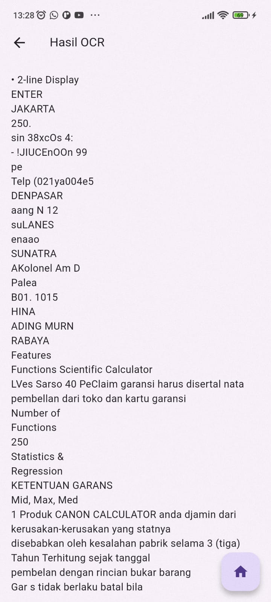
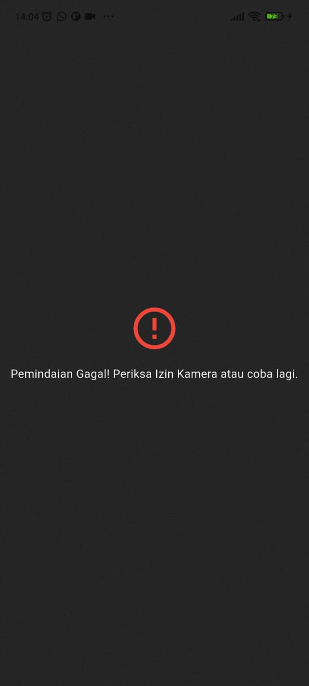
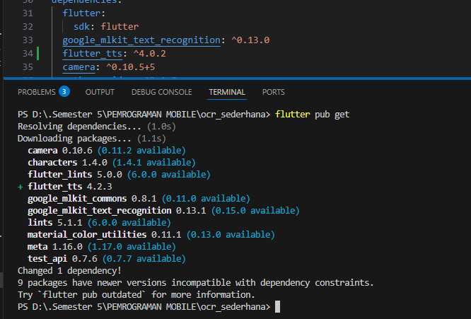

# JOBSHEET DAN UTS  – APLIKASI OCR DENGAN  FLUTTER

# Hasil Parktikum OCR Sederhana

## Home Screen

## Scan Teks

# Hasil Implementasi UTS

## Soal 1 Modifikasi Struktur Navigasi dan Aliran 
### 1 Mengubahan Navigasi Home 

### 2 Teks Utuh dan Navigasi Balik 

---

## Soal 2: Penyesuaian Tampilan dan Penanganan State/Error
### 1.Custom Loading Screen di ScanScreen 

### 2.Spesifikasi Pesan Error 

---
## Soal 3: Implementasi Plugin Text-to-Speech (TTS) 
### 1.Instalasi Plugin 

### 2.Konversi Widget dan Inisialisasi 
### 3.Fungsionalitas Pembacaan 

---
## 🔗 Link Google Drive
Berikut link hasil project dan video demo UTS:
[Klik di sini untuk membuka Google Drive](https://drive.google.com/file/d/1IfmdtaLYlOjsWW89T-S7SxOOS8n1Fw9S/view?usp=sharing)

